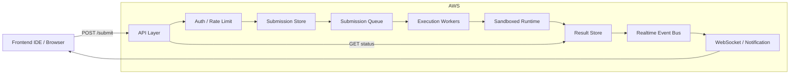

# Scalable Coding Submission Evaluation Module

## Objective
Design a scalable, secure, fault-tolerant module for evaluating live challenge submissions from 1M+ users. The system must support multiple languages, automatically score submissions against test cases, and provide real-time feedback.

## 1. High-Level Design

The evaluation module is separated into three logical layers:

1. **Ingestion layer**
   - Frontend IDE sends submission payloads to a secure API.
   - Requests are validated, authenticated, and persisted.
2. **Evaluation pipeline**
   - Submissions are enqueued into a durable work queue.
   - Dedicated execution workers process code in sandboxed runtimes.
   - Test case results are evaluated and scored.
3. **Feedback / result delivery**
   - Results are written to a status store.
   - Users receive real-time updates via WebSocket or push notifications.

### Real-time behavior
- Submission is acknowledged immediately with a `submission_id`.
- Evaluation starts asynchronously.
- Status updates are streamed via websocket channels or long polling.
- Once complete, final score and passed/failed testcase details are returned.

## 2. Architecture Diagram



## 3. Key Components

### 3.1 Frontend IDE
- Users submit code from a browser-based IDE or mobile client.
- The payload includes `challenge_id`, `language`, `code`, and optional metadata.
- Transport uses HTTPS and JSON.

### 3.2 API layer
- Accepts submissions through REST or GraphQL.
- Validates payload structure and permissible languages.
- Enforces quotas, concurrency, and anti-abuse checks.
- Persists the submission record with initial status `queued`.
- Returns a `submission_id` immediately.

### 3.3 Queueing and ingestion
- Use a durable queue to decouple submission ingestion from execution.
- A queue handles burst traffic and enables retries.
- The queue should support 1M+ submissions per hour, which is ~278 submissions per second on average.

### 3.4 Execution workers
- Stateless workers consume queued submissions.
- Each worker retrieves submission metadata and test cases.
- Code runs in isolated sandboxes or containers.
- Multi-language runners are supported via language-specific runtimes.

### 3.5 Test case evaluation
- Submit code is executed against a set of predefined test cases.
- Each run returns real output, execution time, memory use, and exit status.
- Results are compared against expected output and recorded.
- Score is computed as `passed / total * 100`.

### 3.6 Realtime feedback
- Updates are published as soon as partial or final results are available.
- Support WebSocket or managed socket service for live updates.
- If websocket is not available, use polling of the result store.

## 4. AWS Components (Recommended)

| Function | AWS Service | Notes |
|---|---|---|
| API gateway | Amazon API Gateway | Secure endpoint for submissions |
| Auth | Amazon Cognito / IAM | User auth and token management |
| Queue | Amazon SQS | Durable queue for work items |
| Execution compute | Amazon ECS / AWS Fargate | Containerized workers, autoscaling |
| Sandbox storage | Amazon ECR | Language runtime container images |
| Test metadata | Amazon RDS / Aurora | Challenge/testcase data store |
| Submission state | Amazon DynamoDB | Fast status lookup and event writes |
| Realtime delivery | Amazon API Gateway WebSocket / Amazon SNS | Instant feedback channel |
| Logging/monitoring | Amazon CloudWatch | Metrics, logs, alerts |
| Traffic distribution | Elastic Load Balancing | Distribute API load |
| Secrets | AWS Secrets Manager | Secure runtime credentials |

### Alternative stack
- API: NGINX + Kubernetes ingress
- Queue: RabbitMQ or Apache Kafka
- Compute: Kubernetes / EKS
- Store: PostgreSQL / MySQL for relational data, Redis for cache
- Real-time: Socket.IO or Redis Pub/Sub

## 5. Queueing, Concurrency, Retry Strategy

### Queueing strategy
- Use a standard queue for high throughput.
- Use multiple queue priorities when needed: critical, normal, low.
- Leverage batching for worker consumers if evaluation supports grouped execution.

### Concurrency
- Autoscale workers based on queue length and CPU/memory usage.
- Place an upper bound on concurrent executions per host to avoid resource exhaustion.
- Use separate worker pools per language or runtime class.
- Enforce per-user and per-challenge limits at the ingress layer.

### Retry and failure handling
- On transient failures, retry up to 2-3 times with exponential backoff.
- Use a dead-letter queue for submissions that fail repeatedly.
- Mark permanently failed submissions with `failed` status and error details.
- Keep execution idempotent by using submission IDs and deduplication keys.

### Example retry behavior
1. Worker fails due to a sandbox timeout.
2. Submission is requeued with backoff.
3. If it fails 3 times, move to DLQ and notify the user.
4. Collect metrics for common failure modes.

## 6. Fault Tolerance and Scalability

### Scalability
- Decouple ingestion from execution using queueing.
- Scale API and worker fleets independently.
- Use autoscaling based on queue depth and CPU/memory.
- Partition evaluation load across multiple availability zones.

### Fault tolerance
- Keep all critical infrastructure multi-AZ.
- Use managed queue and storage services with durability guarantees.
- Use health checks and auto-restart for failing worker tasks.
- Persist submission state so no data loss occurs if a worker fails.

### Data durability
- Store submission and score records in durable database storage.
- Keep logs and events in a centralized observability system.

## 7. Security

- Enforce HTTPS across all endpoints.
- Validate and sanitize all user input before execution.
- Isolate execution in containers or sandboxed VMs.
- Limit outbound network access from runtime containers.
- Use runtime resource caps: CPU, memory, wall-clock time.
- Audit execution logs and monitor suspicious patterns.
- Protect user data with encryption at rest and in transit.

## 8. Notes on Live Challenges and 1M+ Users

- Live challenge traffic has high burstiness. Use elastic autoscaling and queue buffering.
- Provide optimistic submission acknowledgement quickly.
- Use fast status lookup in a cache or NoSQL store for user polls.
- Offer partial progress updates (e.g. `running`, `partial`, `completed`).
- Keep the architecture modular so additional languages and evaluation rules can be added without redesign.

## 9. Sample API Request Example

### Submit code
```bash
curl -X POST http://127.0.0.1:8001/api/submit \
  -H "Content-Type: application/json" \
  -d '{
    "challenge_id": 1,
    "language": "python",
    "code": "a=input()\nprint(a)"
  }'
```

### Expected immediate response
```json
{
  "success": true,
  "submission_id": 7,
  "message": "Code submitted successfully"
}
```

### Poll or stream status
```bash
curl http://127.0.0.1:8001/api/submissions/7/status
```

### Example status response
```json
{
  "submission_id": 12345,
  "status": "completed",
  "passed_testcases": 2,
  "total_testcases": 3,
  "score": 66.67,
  "details": [
    {"testcase_id": 1, "passed": true},
    {"testcase_id": 2, "passed": true},
    {"testcase_id": 3, "passed": false}
  ]
}
```

## 10. Summary

This module is designed to:
- support multiple languages,
- evaluate submissions asynchronously,
- deliver real-time feedback,
- scale to 1M+ submissions per hour,
- remain fault-tolerant and secure.

The architecture depends on a durable ingest queue, isolated execution workers, real-time event delivery, and a resilient storage layer.

## 11. Project Delivery

### code-evaluator-submission.zip

#### What is included
- Full project source files
  - composer.json / composer.lock
  - package.json / package-lock.json
  - .env.example
  - Laravel app, config, database, routes, resources, etc.

#### What is excluded
- node_modules
- vendor
- .git/
- storage
- cache
- .env

#### Next steps for the recipient
After extraction, run:

composer install
npm install
cp .env.example .env
php artisan key:generate
php artisan migrate

